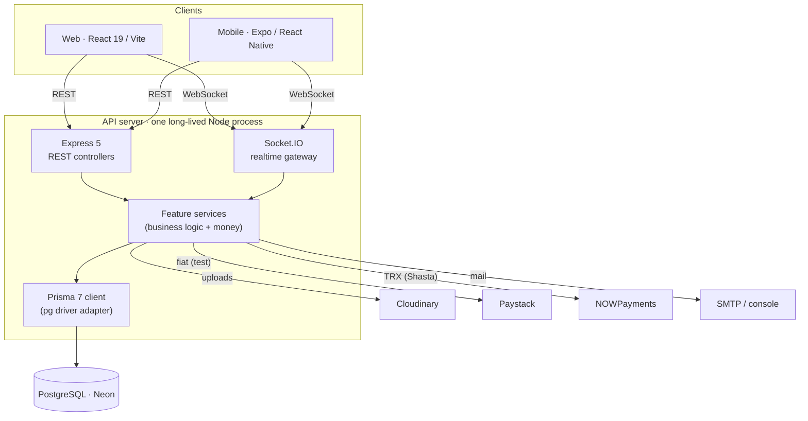
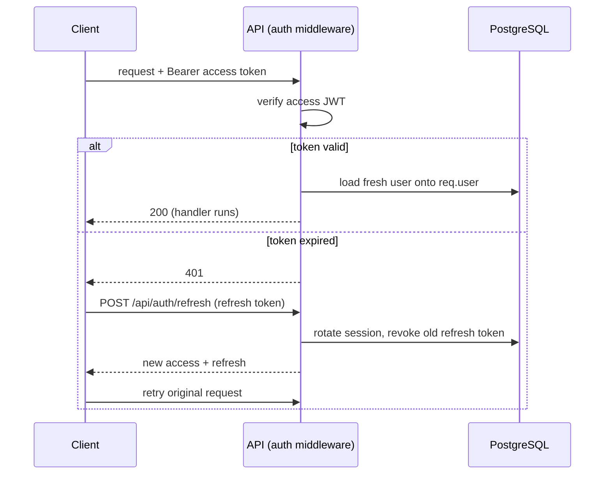
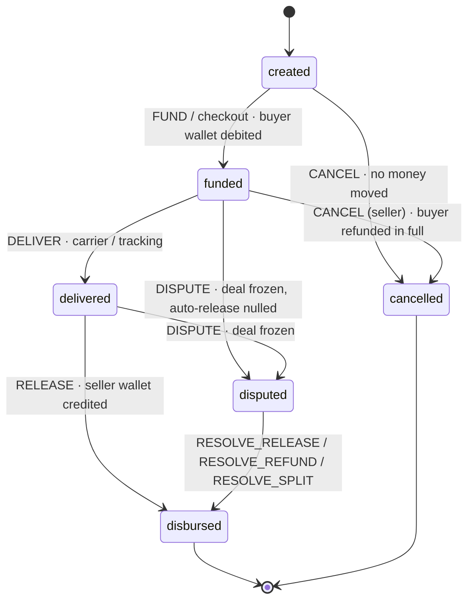
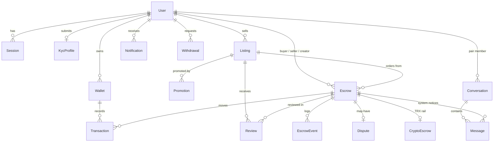

# Architecture

This document explains **how VeriTrust is built** — the moving parts, the request and auth pipeline, the escrow state machine, the money ledger, and the data model. For *what each flow does* end‑to‑end, see [FLOWS.md](FLOWS.md); for setup and deployment, see the [README](README.md) and [DEPLOY.md](DEPLOY.md).

## Contents

- [High‑level topology](#high-level-topology)
- [The API server](#the-api-server)
- [Request & authentication pipeline](#request--authentication-pipeline)
- [Escrow state machine](#escrow-state-machine)
- [The money ledger](#the-money-ledger)
- [Realtime messaging](#realtime-messaging)
- [Payment rails](#payment-rails)
- [Data model](#data-model)
- [Clients](#clients)
- [Cross‑cutting design decisions](#cross-cutting-design-decisions)

---

## High‑level topology

Express and Socket.IO **share one HTTP server and one port** ([`server/src/index.ts`](server/src/index.ts)). That is deliberate: the escrow and admin HTTP controllers emit live deal notices through the *same* `io` singleton the chat sockets use, so a state change made over REST appears instantly in the parties' WebSocket thread — with no message broker between them.

---

## The API server

The backend is organised as **feature modules** (a NestJS‑style layout on plain Express). Each feature under [`server/src/features/`](server/src/features/) owns:

| File | Responsibility |
| --- | --- |
| `*.router.ts` | Route table; wires middleware (`auth`, `requireSeller`, `requireAdmin`, `validate`) |
| `*.controller.ts` | Thin HTTP layer — parse request, call the service, shape the response |
| `*.service.ts` | Business logic and **all** database/money mutations |
| `*.validation.ts` | Joi schemas (unknown keys stripped, values coerced) |
| `*.model.ts` | Prisma query helpers / row shaping (where used) |

Cross‑cutting code lives in [`server/src/shared/`](server/src/shared/): `config/` (env + CORS), `middleware/` (auth, validate, error), `lib/` (`prisma`, `errors`, payment clients, LAN detection), `realtime/` (the `io` singleton + gateway wiring), and `mail/`.

**Errors** are thrown as `ApiError.*` (`400/401/403/404/409/501`) inside services; a single error middleware shapes every response as `{ error, details? }`. Services never write HTTP directly.

---

## Request & authentication pipeline

Auth is **stateless JWT with rotating refresh tokens** — `Authorization: Bearer` only, no cookies.

- **Passwords** are hashed with **argon2id**. Login accepts an email *or* username, returns generic errors (no account enumeration), and runs a dummy hash on a miss to equalise timing.
- **Refresh tokens rotate** on every use; reusing a revoked token revokes the whole session family (theft detection). Sessions are rows in the DB and can be revoked (logout, password change).
- **Client side**, one fetch client attaches the token and performs a **single transparent refresh‑and‑retry** on a 401 (`web/src/features/shared/libs/api.ts`; mirrored in mobile).
- **Authorization** is role‑based: `auth` loads the user, `requireSeller` gates seller actions (KYC‑verified), `requireAdmin` gates the admin console. There are no user‑specific route prefixes — access is decided by role, and enforced server‑side even when a client also routes by role.

---

## Escrow state machine

The escrow engine is the heart of the system. **Every** transition — for marketplace orders and standalone deals alike — goes through a single `transition()` gateway in [`escrows.service.ts`](server/src/features/escrows/escrows.service.ts). The gateway:

1. checks the **actor** is allowed to make this move from the **current state** (a whitelist, in [`escrow-machine.ts`](server/src/features/escrows/escrow-machine.ts)),
2. moves money **in the same database transaction** as the state change,
3. appends an immutable `EscrowEvent`, and
4. posts a system line into the parties' chat thread.

Status is **never** mutated directly anywhere else.

| From | Transition | Actor | Money effect |
| --- | --- | --- | --- |
| `created` | `FUND` / checkout | buyer | debit buyer wallet (fiat simulated); decrement stock |
| `created` | `CANCEL` | either | none |
| `funded` | `DELIVER` | seller | none |
| `funded` | `CANCEL` | seller | **refund buyer in full**, restore stock |
| `funded`/`delivered` | `DISPUTE` | either | freeze; no money moves |
| `delivered` | `RELEASE` | buyer | **credit seller** (amount − seller's fee share) |
| `disputed` | `RESOLVE_*` | admin | credit seller and/or buyer per the ruling |

**Disputes freeze the pair, not just the deal:** while a dispute is open between two users, neither can start another deal with the other (`assertNoOpenDispute` → 409). An admin ruling is **final** and is the only way a dispute ends. Auto‑release and auto‑resolution are intentionally disabled — a frozen deal waits for a human. See [FLOWS.md §5–§7](FLOWS.md).

### Fee arithmetic

Fees are computed in **integer pesewas** (never floating point) and the fee is **stored once at creation**, so the quote a party agreed to is the one that settles. Fiat is **1.5%** (min GH₵2, cap GH₵150); crypto is **1.0%**; the fee is split 50/50 by default (`FeeSplit` records who absorbs it). All money columns are `Decimal(14,2)`. The logic lives in [`money.ts`](server/src/features/escrows/money.ts).

---

## The money ledger

Wallets and transactions form an auditable ledger. There is **one `Wallet` per user per currency** (GHS and TRX), and **every** balance change writes a signed `Transaction` row (`+` credit, `−` debit) linked to the deal that caused it.

- **Balances are derived into three buckets** the UI shows: *available* (cleared), *pending clearance* (seller payouts held 24h, except admin‑resolved), and *escrow‑locked* (Σ funding of active deals).
- **Debits are atomic and guarded** — a withdrawal or a fund uses a conditional update that fails if the balance would go negative, so the same balance can never back two operations at once. A short balance rolls the whole operation back (e.g. checkout restores stock).
- **Withdrawals are first‑class rows**, not just a transaction: the wallet is debited when the request is *created* (so one balance can't back several pending payouts), and an admin rejecting one **credits the money back**. `reference` is an idempotency key, so a retried payout returns the original row instead of debiting twice.
- **Deposits** (fiat, test mode) create a `PaymentIntent` flipped to `success` **exactly once** by either the signature‑verified webhook or the verify poll — the guarded update makes double‑crediting impossible.

---

## Realtime messaging

One 1:1 conversation per user pair, live over **Socket.IO**, with **Postgres as the source of truth** — the socket is the transport, not the store, so history survives reloads and offline parties catch up on reconnect.

- The handshake carries the JWT access token; a socket middleware verifies it and attaches `userId`, rejecting anonymous connections.
- Every socket joins a `user:<id>` room (cross‑thread notifications and unread bumps) and joins `convo:<id>` while a thread is open (messages, read ticks, typing).
- Messages are `text` | `file` | `system`. Files upload to Cloudinary over HTTP; only the URL + metadata travel over the socket. `system` lines are the escrow lifecycle notices.
- **Deal notices are persist‑then‑emit:** an escrow transition writes a `system` message *and* emits it live to both parties. An offline party still sees it on next open (it's in the DB); an online party sees it appear instantly. This is also what auto‑populates the **dispute evidence transcript** the admin reads.

Design detail: [MESSAGING-PLAN.md](MESSAGING-PLAN.md). *(Single‑instance only — no Redis adapter yet.)*

---

## Payment rails

VeriTrust has two rails behind one ledger:

- **Fiat (GHS)** — **simulated by default**: checkout is born `funded` and wallet money moves atomically in the DB, but no processor is charged. A **Paystack** test‑mode integration exists (`POST /api/wallet/deposit/init` + a signature‑verified webhook) to demonstrate a real deposit *flow* against test money. Leave the Paystack key blank and the instant simulated deposit is used instead.
- **Crypto (TRX, TRON Shasta testnet)** — via **NOWPayments'** hosted invoice. The provider holds the coins and owns the address, so **the platform never takes custody of a private key**. `orderRef` is the idempotency key for the whole deposit; the FUND transition it triggers is claimed by escrow status, so a webhook and a poll racing each other still fund exactly once. This rail is **testnet only** and parts of on‑chain payout/refund are still in progress.

The rail is chosen per deal; the same escrow state machine and ledger sit behind both.

---

## Data model

PostgreSQL via Prisma 7. All enum values are **lowercase to match the web client's vocabulary exactly** — there is no mapping layer between DB and UI. The full schema (~25 models, with per‑field commentary) is [`server/prisma/schema.prisma`](server/prisma/schema.prisma). The core relationships:

Notable choices:

- **Immutable audit trails.** `EscrowEvent` is an append‑only state timeline; `Message` rows are immutable and auto‑attach as dispute evidence; withdrawals, KYC reviews and takedowns all stamp actor + timestamp.
- **Soft deletes where history matters.** A removed listing goes to a `removed` status rather than being deleted, because escrow deals reference it and the deal history must stay intact.
- **`uuid(7)` primary keys** — time‑sortable UUIDs.
- **Prisma 7 specifics:** connection URLs live in `prisma.config.ts` (not the schema); the client is generated into `src/generated/prisma/` (gitignored — so `prisma generate` is mandatory in a fresh checkout and in CI/deploy); the runtime uses the `@prisma/adapter-pg` driver adapter.

---

## Clients

Both clients are **feature‑sliced** and share the same backend, auth model, and much of the same vocabulary.

**Web** ([`web/`](web/)) — React 19 + Vite. Routing guards are React Router layout routes (`SellerGuard`, `AdminGuard`) wrapping `<Outlet/>`; role branching via `useMe()`. **Filters and pagination live in the URL** (`useSearchParams`), so deal, user and dispute lists are shareable. Server state is TanStack Query; forms are React Hook Form + Zod; styling is Tailwind 4 with a persisted light/dark theme. All calls go through one fetch client with transparent 401 refresh.

**Mobile** ([`mobile/`](mobile/)) — Expo SDK 54 + React Native + Expo Router (file‑based routing under `src/app/`). Tokens are stored in `expo-secure-store`; the app auto‑discovers the API host from the Expo bundle host on `:8000` (override with `EXPO_PUBLIC_API_URL`). It reuses the same feature vocabulary as web (marketplace, escrow, wallet, messages, admin) and returns cleanly from external payment redirects (Paystack / NOWPayments).

---

## Cross‑cutting design decisions

- **One transition gateway.** All escrow money and state changes funnel through `transition()` — the single place guarding actor + state and keeping money atomic with the event log. This is why concurrency and dispute freezing are correct.
- **Persist‑then‑emit realtime.** The DB is always the source of truth; the socket only accelerates delivery. Nothing is lost if a client is offline.
- **Idempotency keys on every external‑money touch** (deposits, withdrawals, crypto deposits) so retries and racing webhooks/polls settle exactly once.
- **Secrets stay out of the repo.** `.env` is gitignored; only `.env.example` is committed. The server auto‑detects LAN IPs in development so no machine‑specific config is ever committed.
- **Deploy the API near the database.** Every request is several round trips to Postgres; the API is pinned to Frankfurt alongside Neon, and warms a connection pool at boot to hide TLS handshakes ([`index.ts`](server/src/index.ts)). See [DEPLOY.md](DEPLOY.md).
